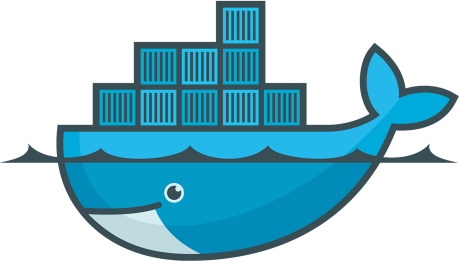
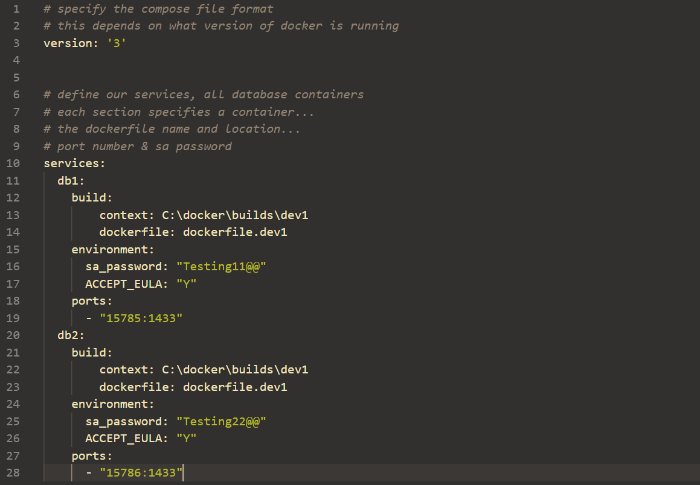
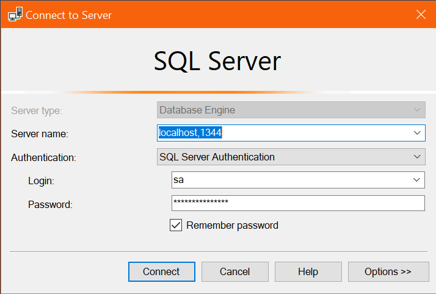

# Docker



### Spin Up A SQL Database Quicker Than This Talk

---

# Another VM?


note:
Is Docker just another VMWare?<br>
Nope, these are containers, unlike virtual machines which need a whole OS and all<br>
Docker just contains the bare essentials<br>

---

# Where Is It?

[Find on the Docker Hub](https://hub.docker.com/editions/community/docker-ce-desktop-windows)

N.B. This is for Windows 10 Professional & Enterprise, for anything older [download the legacy version](https://docs.docker.com/toolbox/toolbox_install_windows/)

Once installed you should see a 'lil whale in the Taskbar.


note:
Nice and easy to install, if you're on Win10. Slightly more painfufl if not<br>
As with most installations, this is a Box & Next checking exercise<br>
When all is done and running, you'll notice it in the taskbar.

---

# Get Up & Running

Docker is a CLI application, so all calls have to be made in Powershell/CMD/Bash/etc...

note:
Docker is a CLI, so needs to be run from a terminal. Although there are a number of 3rd party GUI tools.<br>

---

# Basic Flow


---

# How it's done

```powershell
# Grab the most recent version of image
> docker pull mcr.microsoft.com/mssql/server:2019-latest

# Run a containter called SqlDemo1 through localhost:1344
> docker run --name SqlDemo1 -e "ACCEPT_EULA=Y" `
    -e "SA_PASSWORD=aeb128SS111we" -p 1344:1433 `
    -d mcr.microsoft.com/mssql/server:2019-latest
```

note:
First command grabs the most recent image from microsoft for SQL2019<br>
Second command creates a container, explain parameters

---

# Too much?

We can create a `dockerfile`


We then `build` this dockerfile and run using

```powershell
> docker run -d -p 15788:1433 --name SqlDemo2 demoImage
```

note:
a dockerfile is a set of instructions that can be ran on an image to create our own image<br>
as well as commands to be run when the container is up

--

# Or...

## docker-compose



```powershell
> docker-compose up -d
```

note:
The docker compose file directs what commands are run in docker.<br>
The nice thing about this is you can configure multiple containers at once.

---

# Spin 'em up!

Running the initial `docker run` &rarr; container built and spun up

Running `docker stop` or `docker kill` &rarr; container stops but remains in saved state

Running `docker start` &rarr; container starts back up again

note:
When you run the initial run command, it'll spin up a container for you<br>
You can stop or kill the container, and start it back up again

--

# Removing Containers

To remove the container completely use

```powershell
> docker rm [ID]
```

Any persisted data or storage will also be removed, so ensure what you have is backed up or stored outside of the container

---

# What's running?

```powershell
> docker container ls
```


```powershell
> docker container ls -a
```


note:
There's 2 simple commands to see what's going on<br>
`ls` to see containers that are up<br>
`ls -a` to see containers whether up or down

--

# Docker Dashboard


note:
Or there's the dashboard, which you can spin up and kill containers<br>
As well as log into the interactive terminal to interact with the container

---

# Hydration Time


---

# Quick Recap

- Container environments **not** VM
- You download the image &rarr; Run to spin it up into a container
- Use `dockerfile` and `docker-compose.yml` to customise spin up
- Interact via CLI

---

You now know the what and how...

# But why?


note:
most _non-sql_ use cases use docker to provide a single environment to work with<br>
no matter what machine it's working on, without the need to reinstall libraries

--

# Why

- Single Contained Environment
- Already Pre-configured for use
- Easy to Build & Destroy
    - Excellent for development
    - Excellent for testing
    - Excellent for any type of temporary environment
- Orchestration
    - Can easily increase the number of identical containers
    - Perfect for load balancing

note:
Its perfect for any time you need temporary environements, and <br>
for quickly scaling up/down for load balancing.

--

# Not All of these can apply to how we SQL

note:
Unfortunately for database development, we need a persistant database.<br>
We could try and change the structure of the database that we can link to but that<br>
will ruin the database for everyone else. It would require another change to how we develop.

---

# But...

Works Wonders for running SQL Demonstrations

& Using Containers in the CI/CD Pipeline

- Build Environments
- Testing Environments

note:
But for SQL demonstrations that we can easily have other people download and play with<br>
or introducing proper testing in DevOps where we want to spin up/down all of the time

---

# So How To SQL

Once we spin up an instance we simply connect using SSMS with the ports & SA password we defined earlier.



note:
Once we spun up an instance, connecting is a piece of cake<br>
just remember to use SQL Authentication not Windows

---

# Teach Me More


Docker provides a ["school" learning website](https://training.play-with-docker.com/) & Microsoft has [a nice setup page](https://docs.microsoft.com/en-us/sql/linux/quickstart-install-connect-docker?view=sql-server-ver15&pivots=cs1-powershell) for SQL containers.
