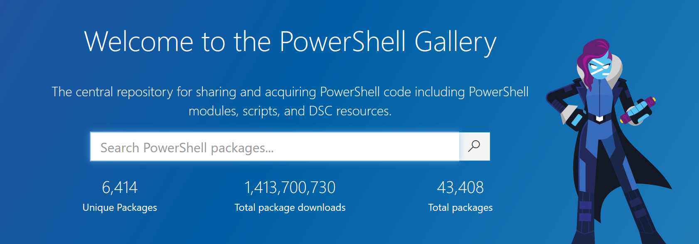

# Powershell

## ... Or How the Cool People Say It

`pwsh.exe`

note:
Quick 5 min presentation on what it is and how to use it<br>
Ignite format presentation - 20 x 15sec slides that is automatic

---

# What is it?

note:
Language and Scripting replacement to `cmd.exe`<br>
2 versions -> v5 & v6+ called Powershell Core

---

# How to get it

[Straight from Microsoft](https://docs.microsoft.com/en-us/powershell/)

note:
Powershell comes preinstalled<br>
Core can be found on MS website

---

# How to - Flow

Everything that any programming language can do!

- Variables
- Conditionals
- Looping
- Object Oriented & Functional Programming Paradigms

note:
Powershell has all of the features that any language has<br>
As it's a modern language it has asynchronous functions out of the box.

---

# How to - Cmdlet

```powershell
> [Verb]-[Noun] descriptors [-parameter]

> Get-Date
20 February 2020 20:35:40

> Get-Help Get-Date
NAME
    Get-Date

SYNTAX
    Get-Date [[-Date] <datetime>] [-Year <int>] [-Month <int>] 
    [-Day <int>] [-Hour <int>] [-Minute <int>] [-Second <int>] 
    [-Millisecond <int>] [-DisplayHint {Date | Time | DateTime}] 
    [-Format <string>]  [<CommonParameters>] ...
```

note:
Alongside the standard programming flow there are cmdlets<br>
These are built up on Verb-Noun commands<br>
If in need of any help... use `Get-Help`

--

# Verbs

```powershell
> Get-Verb
```

Most commonly used include `Get`, `Set`, `Remove`, & `New`

These verbs are [enforced by Microsoft](https://docs.microsoft.com/en-us/powershell/scripting/developer/cmdlet/approved-verbs-for-windows-powershell-commands?view=powershell-7#common-verbs), even for custom made add ons.

note:
All verbs can be found using the simple expression `Get-Verb`<br>
Further details can be found using the link here<br>

--

# Commands

```powershell
> Get-Command
MASSIVE LIST

> Get-Command -Verb Set
SLIGHTLY SMALLER LIST

> Get-Command -Verb Set | Where-Object Source -match VpnClient
CommandType  Name                                     Version    Source
-----------  ----                                     -------    ------
Function     Set-VpnConnection                        2.0.0.0    VpnClient
Function     Set-VpnConnectionIPsecConfiguration      2.0.0.0    VpnClient
Function     Set-VpnConnectionProxy                   2.0.0.0    VpnClient
Function     Set-VpnConnectionTriggerDnsConfiguration 2.0.0.0    VpnClient
Function     Set-VpnConnectionTriggerTrustedNetwork   2.0.0.0    VpnClient
```

note:
There are billions of inbuilt commands, use `Get-Command` to get a list<br>
If it's too big, you can filter using parameters or by piping into other commands
--

# Want More Commands?

note:
There are many things that aren't included out of box<br>
Such as working with Azure, playing with VMWare, Docker, Redgate tools, etc...

--

# Introducing...



note:
The Powershell Gallery contains a massive repository of 3rd party cmdlets and functions
Easily install using the command `Install-Module -Name ...`

---

### Quick Summary

- Powershell both a scripting & programming lang
- 2 Types
  - Powershell up to v5 (Windows only)
  - Powershell Core v6+ (Cross Platform & Open Source)
- All the basic features of programming lang
- Extendable with Cmdlets
- [Verb]-[Noun] for ease of use
- Already tonnes of Cmdlets out of the box
- Not enough? There's the Powershell Gallery

--

### Quick Water Break


---

# Using Powershell in BI

note:
Suprise suprise! we already use some Powershell in our Department<br>
These are all simple-ish scripts that are called as part of other processes.

---

# Azure Dev Ops

### Problem

All our images are based on a Masked Mirror

Need to load into our 'consuming' databases (such as OxfordHealthDW) and create images when done.

**AND** clean up so we don't have too many images

#### All of this needs to be done in DevOps, with no human interaction

note:
We need to create images for our databases, but using data from a masked mirror<br>
there's a couple of scripts that help us with this

--

### Solution - Pt.1

```powershell
DropAndRebuildDatabases.ps1
```

Cleans out data from 'consumer' databases

note:
First we need to empty out databases<br>
This script loops through them and runs TRUNCATE TABLE against everything

--

### Solution - Pt.2

```powershell
SQLJobRun.ps1
```

Runs a SQL Agent Job

note:
This runs a whatever SQL Agent job is fed into it

--

### Solution - Pt.3

```powershell
SQLJobCheck.ps1
```

Pings SQL Agent to see if job is running

note:
This checks the status of a job, if it's still running it'll sleep for 30 seconds, then try again
--

### Solution - Pt.4

```powershell
SQLJobResultsAndBuildImage.ps1
```

Check last outcome of SQL Agent Job

If success - create image

note:
SQL Clone comes with a load of cmdlets.
This script creates images when the SQL Agent Job is sucessful

--

### Solution - Pt.5

```powershell
TrimImages.ps1
```

Delete anything older than last 5 images

note:
We list the images in order of newest to oldest.<br>
Skip the first 5 and delete the rest

---

### Wrap up

All these scripts are used by us & can be found in:

- Utils git repo (under scripts)

Other scripts can be found in:

- Truecolours SSIS
- ECDS SQL Agent Job

note:
All these scripts are found in git<br>
You can check the DevOps build pipeline to see how it fits

---

### Want More?

To learn more Powershell the [Microsoft Documentation is a good place to start](https://docs.microsoft.com/en-us/powershell/scripting/overview?view=powershell-7)

note:
Microsoft provides brilliant documentation,<br>
failing that, Google is your friend

---


Any Questions?
