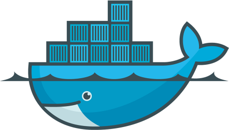

# Docker



### Spin Up A SQL Database Quicker Than This Talk

---

# Another VM?


note:
Is Docker just another VMWare?<br>
Nope, these are containers, unlike virtual machines which need a whole OS and all of the libraries & unneccessary apps associated with it<br>
Docker just contains the bare essentials<br>
For example, for SQL we just need all the SQL and networking services, we don't need anything in regards to IIS

---

# Where Is It?

[Find on the Docker Hub](https://hub.docker.com/editions/community/docker-ce-desktop-windows)

N.B. This is for Windows 10 Professional & Enterprise, for anything older [download the legacy version](https://docs.docker.com/toolbox/toolbox_install_windows/)

Once installed you should see a 'lil whale in the Taskbar.


note:
Nice and easy to install, if you're on Win10. Slightly more painfufl if not<br>
As with most installations, this is a Box & Next checking exercise<br>
When all is done and running, you'll notice it in the taskbar.

---

# Get Up & Running

Docker is a CLI application, so all calls have to be made in Powershell/CMD/Bash/etc...

note:
Docker is a CLI, so needs to be run from a terminal. Although there are a number of 3rd party GUI tools.<br>

---

# Basic Flow


---

# How it's done

```powershell
# Grab the most recent version of image
> docker pull mcr.microsoft.com/mssql/server:2019-latest

# Run a containter called SqlDemo1 through localhost:1344
> docker run --name SqlDemo1 -e "ACCEPT_EULA=Y" `
    -e "SA_PASSWORD=aeb128SS111we" -p 1344:1433 `
    -d mcr.microsoft.com/mssql/server:2019-latest
```

note:
First command grabs the most recent image from microsoft for SQL2019<br>
Second command creates a container, explain parameters

---

# Too much?

We can create a `dockerfile`


We then `build` this dockerfile and run using

```powershell
> docker run -d -p 15788:1433 --name SqlDemo2 demoImage
```

note:
a dockerfile is a set of instructions that can be ran on an image to create our own image<br>
in this example, we use the latest MS SQL image, but automatically accept the EULA & set a password<br>
We could, if we want set the password in a separate file and provide a path to that instead if we wanted better control on source control<br>
The rest of the dockerfile imports and restores a database backup that is found, in this case, locally. But could point to a backup anywhere<br>
Notice the /var/opt/sqlserver - this is a filepath on linux<br>
Another method is by having a docker-compose file, instead of building a brand new image, this runs alongside an image each time yo build a container

---

---

---

---

---

---

---

---

---

---

---

---

---

---

---
