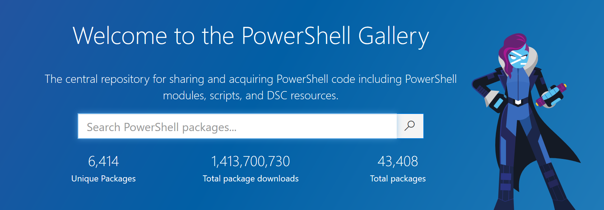

# Powershell

## ... Or How the Cool People Say It

`pwsh.exe`

note:
Quick 5 min presentation on what it is and how to use it<br>
Ignite format presentation - 20 x 15sec slides that is automatic

---

# What is it?

note:
Technically a programming language<br>
Also a scripting tool<br>
Replacement to `cmd.exe`<br>
2 versions v0 -> v5 & v6 Core

---

# How to get it

[Straight from Microsoft](https://docs.microsoft.com/en-us/powershell/)

note:
Powershell up to v5 comes preinstalled with Windows<br>
Core available to download from microsoft<br>
Can be installed side by side<br>
Simple to install, simple to run

---

# How to - Flow

Everything that any programming language can do!

- Variables
- Conditionals
- Looping
- Object Oriented & Functional Programming Paradigms

note:
Powershell has all of the features that any language has<br>
As it's a modern language it has asynchronous functions out of the box.

---

# How to - Cmdlet

```powershell
> [Verb]-[Noun] descriptors [-parameter]

> Get-Date
20 February 2020 20:35:40

> Get-Help Get-Date
NAME
    Get-Date

SYNTAX
    Get-Date [[-Date] <datetime>] [-Year <int>] [-Month <int>] 
    [-Day <int>] [-Hour <int>] [-Minute <int>] [-Second <int>] 
    [-Millisecond <int>] [-DisplayHint {Date | Time | DateTime}] 
    [-Format <string>]  [<CommonParameters>] ...
```

note:
Alongside the standard programming flow there are cmdlets<br>
These are built up on Verb-Noun commands<br>
If in need of any help... use `Get-Help`

--

# Verbs

```powershell
> Get-Verb
```

Most commonly used include `Get`, `Set`, `Remove`, & `New`

These verbs are [enforced by Microsoft](https://docs.microsoft.com/en-us/powershell/scripting/developer/cmdlet/approved-verbs-for-windows-powershell-commands?view=powershell-7#common-verbs), even for custom made add ons.

note:
All verbs can be found using the simple expression `Get-Verb`<br>
Further details can be found using the link here<br>

--

# Commands

```powershell
> Get-Command
MASSIVE LIST

> Get-Command -Verb Set
SLIGHTLY SMALLER LIST

> Get-Command -Verb Set | Where-Object Source -match VpnClient
CommandType  Name                                     Version    Source
-----------  ----                                     -------    ------
Function     Set-VpnConnection                        2.0.0.0    VpnClient
Function     Set-VpnConnectionIPsecConfiguration      2.0.0.0    VpnClient
Function     Set-VpnConnectionProxy                   2.0.0.0    VpnClient
Function     Set-VpnConnectionTriggerDnsConfiguration 2.0.0.0    VpnClient
Function     Set-VpnConnectionTriggerTrustedNetwork   2.0.0.0    VpnClient
```

note:
There are tonnes of inbuild commands<br>
Use `Get-Command` to get a list<br>
Can filter based on Verbs, or any of the headers by piping into Where-Object<br>
Want to know other options/parameters? Use Get-Help Get-Command

--

# Want More Commands?

note:
Whilst powershell comes with literally thousands of commands out of the box<br>
There are definitely many things that aren't included<br>
Working with Azure, playing with VMWare, Docker, Redgate tools

--

# Introducing...



note:
The Powershell Gallery contains a massive repository of 3rd party cmdlets and functions
Easily install using the command `Install-Module -Name ...`

---

# Developing

- Call and Response: Using the Shell
- Full on Programming: Using the ISE or IDE

note:
The standard installation includes the shell & ISE<br>
Shell, like a standard command line where you can write a command and a response is returned<br>
A programming environment where you create full blown programs<br>
There's even graphical libraries to develop GUI applications if you really want to

---

### Quick Summary

- Powershell both a scripting & programming lang
- 2 Types
  - Powershell up to v5 (Windows only)
  - Powershell Core v6+ (Cross Platform & Open Source)
- All the basic features of programming lang
- Extendable with Cmdlets
- [Verb]-[Noun] for ease of use
- Already tonnes of Cmdlets out of the box
- Not enough? There's the Powershell Gallery

--

### Quick Water Break


---

# Using Powershell in BI

note:
Suprise suprise! we already use some Powershell in our Department
These are all simple-ish scripts that are called as part of other processes.

--

# Truecolours

### Problem

SSIS previously used 7zip, that wasn't compatible on live server

### Solution

```powershell
> Expand-Archive Source.zip DestinationFolder
```

--

# ECDS

### Problem

ECDS needs to be exported in xml that couldn't be handled in SQL Server

### Solution

String Manipulation and Saving Files & `Export-Csv`

note:
SQL server has strict-ish rules with how it generates XML for example hierarchical structures are difficult to deal with<br>
Store the building blocks in SQL and put it all together with powershell and push into a file<br>
P&I also wanted a csv version, so used `Export-Csv` to do that too

---

# Azure Dev Ops

### Problem

- Automate the image capture of mirror
- Run our load processes & wait for them to finish
- Capture the image of our 'consuming' databases
- **and** Clean up so we don't have too many images

note:
Because of the masking set we use on mirror, we need to clone that first, then run out usual jobs (i.e. OxfordHealthDW). Wait for them to finish (which can take anywhere from 10mins to over an hour) and create images from these. All tagged with the same ID

--

### Solution - Pt.1

`DropAndRebuildDatabases.ps1` - Cleans out data from 'consumer' databases

- Loops through an array of databases
- Creates a sqlconnection to the database
- Runs `TRUNCATE` on tables based on `INFORMATION_SCHEMA.TABLES`
- Closes the sqlconnection

note:
A fairly simple powershell that mainly contains SQL that could be run in SSMS<br>
But DevOps doesn't have this ability<br>
So instead we loop through an array of database names and generate Truncate statements against them<br>
We need to close the connection we created at the end.

--

### Solution - Pt.2

`SQLJobRun.ps1` & `SQLJobCheck.ps1`

- Open up a connection to database and run a job based on a parameter fed into it
- Once running, have a while loop to check if the job has finished

note:
These 2 scripts are for populating the empty databases with the masked data from Mirror<br>
SQLJobRun.ps1 uses a parameter fed into it and kicks off the SQL agent job<br>
SQLJobCheck.ps1 checks this job using a while loop, if the job is completed a var is changed to break the loop and a finish job command is called

--

### Solution - Pt.3

`SQLJobResultsAndBuildImage.ps1`

- If the preceeding job has finished with a success, use Redgate Cmdlets to connect to SQL Clone server and make datebase images
- If the job failed, flow an error flag

note:
SQL Clone comes with a load of cmdlets to control the creation, cloning, and deleting of sql clone images<br>
This script tests to see if the job ran was a success, if so then create an image<br>
We also pass in the build id of the mirror image which is stored in the Azure Devops pipeline

--

### Solution - Pt.4

`TrimImages.ps1`

- Simply delete older images if the total amount of images per database is > 5

note:
Another nice and simple script<br>
For each database, we order its images by creation date DESC<br>
Then we keep the top 5 by skipping the first 5 results and deleting the rest

---

### Wrap up

All these scripts are used by us & can be found in:

- Truecolours SSIS package
- ECDS SQL Agent Job
- Utils git repo (under scripts)

### Want More?

To learn more Powershell the [Microsoft Documentation is a good place to start](https://docs.microsoft.com/en-us/powershell/scripting/overview?view=powershell-7)