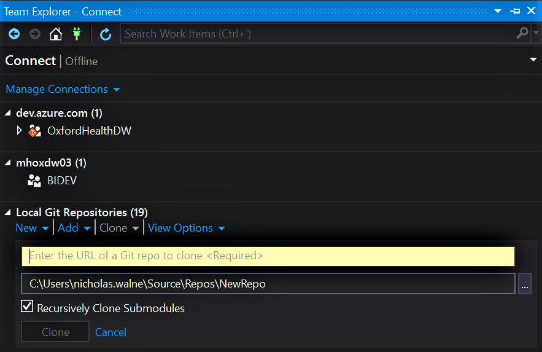
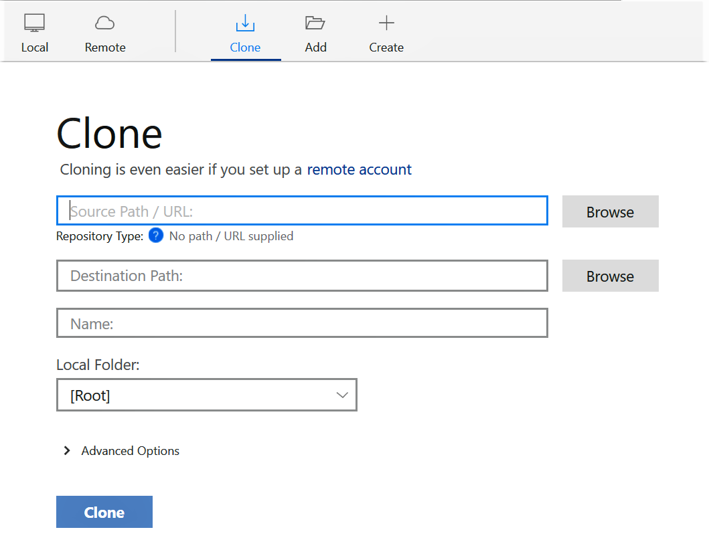
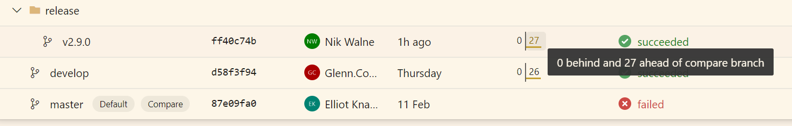
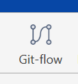
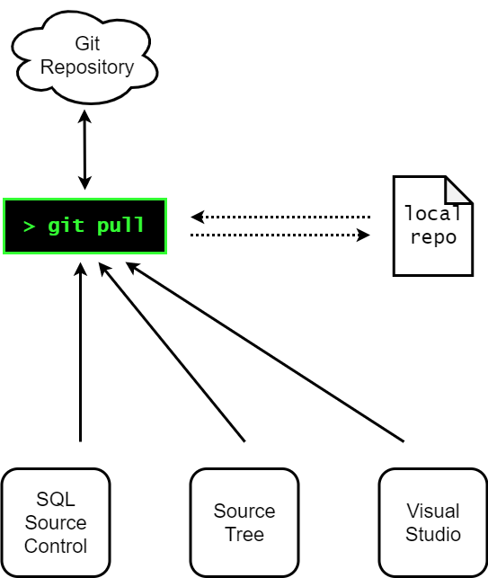
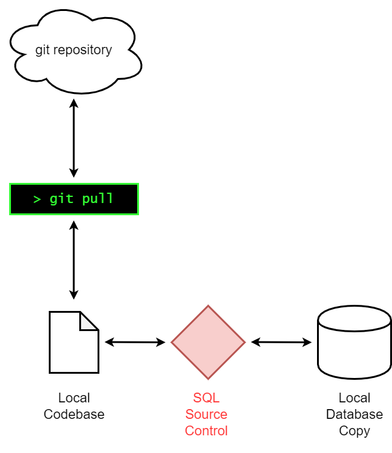
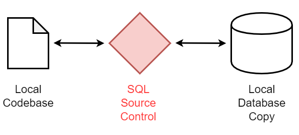
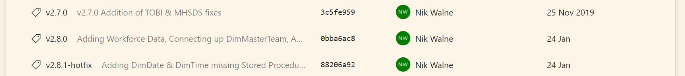

# How we Git


### A somewhat quick run through of BI development

---

## What

note:
According to wikipedia; git is a distributed version control system, which means the entire codebase and history of changes is downloaded onto the local machine.<br>
As opposed to TFS which is a centralised version control system, where technically nothing is downloaded locally.<br>
A master is stored in a repository denoted `ORIGIN`<br>

--

## Why

note:
Most popular version controlling system<br>
Free, Open Source, Universal; unlike TFS again which is locked down to Microsoft/Azure DevOps

--

## What we going to do

- Grab a code base from repository
- Create a new feature branch
- Make some changes to code
- Finish the feature branch; merge back to develop branch
- Create a release candidate, and release new version

---

## Before We Start

- All code will be put up on my personal git
https://github.com/niknudge/pres

- This will also be put up on Azure DevOps
- This is a surface look at our development process, at just git _(and some cross over with SQL Clone & SQL Source Control)_
- You can also return to this presentation [link tbc...]

---

# Getting the Repo


note:
For Azure DevOps, we can access the repo URL from the website<br>
Just select the project you would like, use the bar on the left and<br>
open up the orange menu item. When the page has loaded you can select<br>
clone in the top left and you're given a URL to copy. [Video file can be<br>
found at](res/AccessCloneRepo.mp4)

---

# Downloading Repo

## Visual Studio



--

# Downloading Repo

## CLI

```powershell
> git clone https://OxfordHealthBI@dev.azure.com/OxfordHealthBI/OxfordHealthDW/_git/OxfordHealthDW
```

--

# Downloading Repo

## SourceTree



--

# Downloading Repo

## What We've Done

note:
So what we've done is download the master codebase as well as the metadata behind what changes have <br>
occurred and what changes are contained in other branches, which brings us to

---

## Common git Terms

**Clone** - Download the codebase from repo

**Pull** - Update local copy with changes on repo

**Commit** - Bundle code changes with a message

**Push** - Uploads commits to repo

**Sync** _(VS Only)_ - Pulls, then Pushes

**Branch** - Copy of codebase at a different state

**Checkout** - Switch to a different branch

---

# Branches



note:
Branches are different states of the same codebase, we use the master branch to reflect the state of production<br>
In this example we see that the release branch is 27 commits ahead. In the backend these two codebases are very<br>
similar, the only difference is that the release branch contains a list of what rows have changed to what.

--

# Branching Stategies

We follow a method of branching named **"Gitflow"**, based on an initial [blog post by nvie](https://nvie.com/posts/a-successful-git-branching-model/)

Which recommends 2 permanent branches; `master` and `develop` that reflect a production state and development state respectively

--

# Gitflow


note:
Any new develop occurs in feature/ branches, this keeps any in progress development away from the current development<br>
state. When development is complete, the code is merged back into develop

--

# Gitflow

- New development occurs in `feature/` merged back into `develop`
- `release/` branched from develop, merged into `master` and back into `develop`

--

# Gitflow Tools

Gitflow is so popular that it has its own plugin for `git`. This allows you to simplify each of the common steps that occur in day to day development.

```powershell
> git flow feature start  <featurename>
> git flow feature finish <featurename>
```

--

# Gitflow Tools

Gitflow is also built into many other tools

 

When we first clone a repository, we need to initiate with gitflow, the GUI tools prompt you to do this

note:
for example there are buttons in SourceTree and Visual Studio that utilises gitflow in the GUI

--


note:
Here's the basic process for creating a feature in VisualStudio, most other applications work in the <br>
same way. Notice at the bottom where the inputs are translated into the `git flow` commands.

--

## Then what?

1. Make Changes
2. Create Commits
3. Push Changes
4. Repeat ... **KEEP CODING**


--


note:
Finishing a feature follows similar steps to creating a feature<br>
click the usual buttons and it'll leave you with a commit that needs to be<br>
pushed to the develop branch

--

# Releases

Releases follows the `gitflow` process to merge development code into `master`

Follows much of the same as creating and finishing features

--

# Except

Finishing a feature leaves 2 sets of commits

- One for `develop`
- One for `master`

This is to ensure that any codew changes that occur when people are looking at the release branch (i.e. UAT testing flagging bugs) are merged with both production and development systems

--


---

# Pulling

>Pulling is the defacto thing you should be doing if not developing

Pulling lets your local copy of the code repository know what updates have been occuring on the repository

--

## It Doesn't matter where we pull from

All pulls made, no matter the software, calls the git command & update the local codebase



note:
Pushing works the same way, the applications call the command to update the repo

---

# How BI Do it with other tools

Other things that fit in with our git workflow:

- Redgate SQL Source Control
- Redgate SQL Provision _(SQL Clone)_

--

# SQL Source Control

Works as a go-between for the Database & the plaintext interpretation.



--

# Be aware



note:
SQL Source control can get a bit confused when flicking between branches, it gets unsure about which version of a piece of code is more correct. When changing branch, ensure you apply any changes but also check the commit tab for other changes to undo.

--

# SQL Provision

This gives up a database to work with

note:
Basically a snapshot of the production databases at last release, that can be restored as a local database.
The data is stored on the Clone Server and only changes are stored locally, in an unreadable state.

---

# What we don't see


When we use gitflow for `release/` & `hotfix/` branches, it will also create a tag with the same name (i.e `release/v2.8.0` creates a tag v2.8.0)

These tags form points in the git history.



note:
We can use this to get code showing the state of production at a particular version; also looking between 2 tags, we can see what has occurred between them.
We can also provide a tag message if we'd like

---

# How we don't do it

## Branching stategies

Whilst `gitflow` is popular, it's by no means perfect:

- Top level view can be confusing
- Easy to drift away from master branch
- Harder to follow other git "best practices"

[Many articles](https://medium.com/@patrickporto/4-branching-workflows-for-git-30d0aaee7bf) discuss the pros and cons of other stategies used commonly

--

## Pull Requests

>Pull requests let you tell others about changes you've pushed to a GitHub repository. Once a pull request is sent, interested parties can review the set of changes, discuss potential modifications, and even push follow-up commits if necessary.

note:
Pull requests are a common thing to see when exploring sites like [Github](https://www.github.com)<br>
A way of creating discussion/review points before merging code changes into the base

---

# More in-depth

Github provides a very large [Learning Lab](https://lab.github.com/) that'll reinforce the base concepts as well as more advanced stuff

Atlassian provides a [clear overview](https://www.atlassian.com/git/tutorials/comparing-workflows/gitflow-workflow) of the gitflow process as well

---

# Many Thanks

## Questions?

